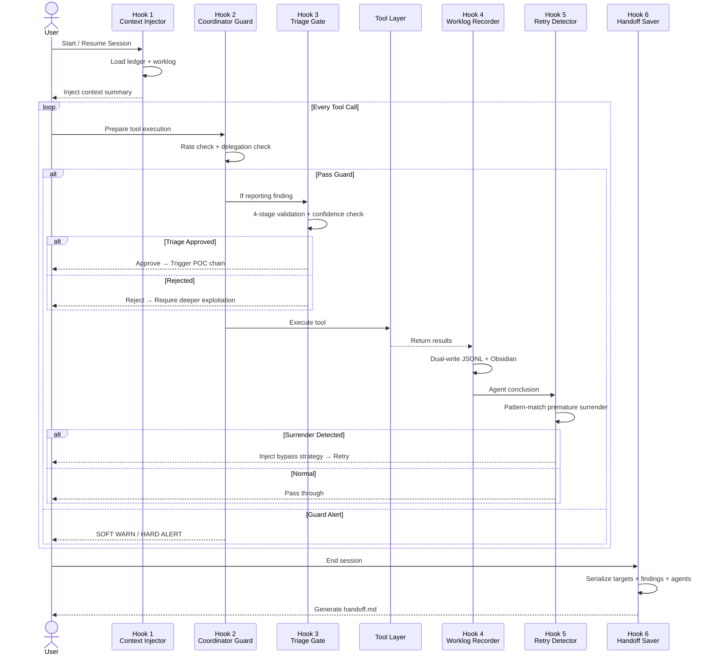
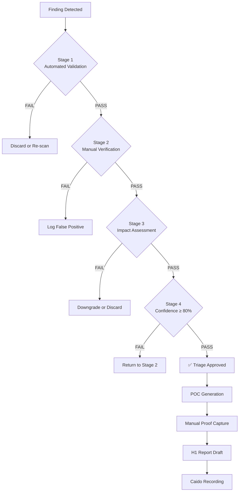

# Mastermind Bug Bounty — Autonomous Offensive Security Orchestration

> A production-grade AI skill that recreates trace37's **Mastermind Hooks Architecture** as
> executable workflow patterns. Gives Kimi persistent hunt memory, triage gates, retry
> logic, and HackerOne-grade output quality.

---

## Overview

This project ports the 6 Claude Code hooks from [trace37 labs](https://labs.trace37.com/blog/mastermind-hooks-architecture/) into a modular, open-source skill system. It transforms a general-purpose AI into an autonomous bug bounty hunter with:

- **Session continuity** — resume any hunt exactly where you left off
- **Intelligent gating** — soft warnings for anti-patterns, hard blocks for unvalidated findings
- **Self-correcting retries** — detects premature surrender and injects bypass strategies
- **Forensic logging** — every tool call, finding, and decision is timestamped and auditable
- **State handoff** — full hunt serialization for long-running engagements

---

## Architecture

The skill implements a **6-hook lifecycle** that gates every phase of a bug bounty session:

<p align="center">
  
</p>

<p align="center">
  
</p>

### Architecture Sequence



### Triage Gate Decision Flow



### The 6 Hooks

| # | Hook | Type | File | Purpose |
|---|------|------|------|---------|
| 1 | **Context Injector** | SESSION | `scripts/session_context.py` | Inject hunt state + 30min worklog on session start |
| 2 | **Coordinator Guard** | PRE-TOOL (soft) | `scripts/coordinator_guard.py` | Rate-limit warnings + enforce specialist delegation |
| 3 | **Triage Gate** | PRE-TOOL (hard) | `scripts/triage_gate.py` | Block findings without demonstrated impact |
| 4 | **Worklog Recorder** | POST-TOOL | `scripts/worklog_recorder.py` | Dual-write JSONL + Obsidian for every action |
| 5 | **Retry Detector** | POST-TOOL | `scripts/retry_detector.py` | Detect premature surrender, suggest bypasses |
| 6 | **Handoff Saver** | COMPACT | `scripts/handoff_saver.py` | Serialize full hunt state for next session |

---

## Project Structure

```
mastermind-bug-bounty/
├── SKILL.md                          # Main skill definition (Kimi workflow patterns)
├── README.md                         # This file
│
├── references/                       # Offensive security knowledge base
│   ├── hunt_methodology.md           # Full recon → discovery → validation → report pipeline
│   ├── bug_classes.md                # 10 modern vulnerability classes with exploitation techniques
│   ├── bypass_techniques.md          # WAF/CDN fingerprinting & bypass encyclopedia
│   └── report_templates.md           # HackerOne / Bugcrowd / CVE submission templates
│
└── scripts/                          # Automation tools (zero external dependencies)
    ├── session_context.py            # Hook 1: Context injection
    ├── coordinator_guard.py          # Hook 2: Soft gatekeeping
    ├── triage_gate.py                # Hook 3: Hard triage validation
    ├── worklog_recorder.py           # Hook 4: Dual-channel logging
    ├── retry_detector.py             # Hook 5: Premature surrender detection
    └── handoff_saver.py              # Hook 6: State serialization
```

---

## Quick Start

### Prerequisites

- Python 3.9+
- No external dependencies (stdlib only)

### Installation

```bash
git clone https://github.com/yourusername/mastermind-bug-bounty.git
cd mastermind-bug-bounty
```

### Setting Up a Hunt Directory

Create a standard hunt workspace:

```bash
mkdir -p my-hunt/vault
python3 -c "
import json
json.dump({
    'hunt_id': 'hunt-001',
    'target': 'example.com',
    'scope': ['*.example.com'],
    'status': 'active',
    'start_date': '2026-05-09T00:00:00Z'
}, open('my-hunt/ledger.json', 'w'), indent=2)
"
touch my-hunt/worklog.jsonl
```

### Running the Scripts

All scripts work standalone or as modules:

```bash
# Hook 1: Inject session context
python3 scripts/session_context.py --hunt-dir ./my-hunt

# Hook 2: Check coordinator guard
python3 scripts/coordinator_guard.py --host example.com --tool ffuf

# Hook 3: Validate a finding through triage gate
python3 scripts/triage_gate.py --finding finding.json

# Hook 4: Record a tool call to worklog
python3 scripts/worklog_recorder.py --type tool_call --tool nmap --hunt-dir ./my-hunt

# Hook 5: Detect premature surrender in agent conclusion
python3 scripts/retry_detector.py --conclusion "WAF blocked my request" --class xss

# Hook 6: Save hunt handoff
python3 scripts/handoff_saver.py --hunt-dir ./my-hunt --instructions "Continue XSS testing on admin panel"
```

### Kimi Integration

Load the skill in Kimi by placing `mastermind-bug-bounty/` in your skills directory:

```
# Kimi will auto-detect and load SKILL.md
# All 6 hooks become enforced workflow patterns
# References are loaded on-demand during hunts
```

---

## References: What's Inside

### `references/hunt_methodology.md` (1,493 lines)

Complete autonomous bug bounty methodology covering:
- **Reconnaissance** — subdomain enumeration, tech fingerprinting, JS analysis, API discovery
- **Vulnerability Discovery** — systematic testing by priority, context-aware payloads, chaining
- **Impact Validation** — 4-level escalation framework, safe data extraction, account takeover PoC
- **Report & Delivery** — HackerOne structure, CVSS 3.1 scoring, responsible disclosure
- **Retry & Bypass** — WAF fingerprinting, encoding tricks, time-based evasion

### `references/bug_classes.md` (2,087 lines)

10 modern vulnerability classes with detection + exploitation:
- **XSS** — Reflected/Stored/DOM/Blind, context analysis, DOMPurify bypass, 5-rotor mutation
- **SQL Injection** — Error/Boolean/Time/Union, NoSQL, ORM patterns, second-order
- **SSRF** — Basic/Blind, cloud metadata (AWS/GCP/Azure), protocol smuggling, DNS rebinding
- **CORS** — 3-part exploitability test, preflight bypass, null origin
- **Authentication** — OAuth/OIDC/PKCE chains, JWT attacks (alg:none, KID), MFA bypass
- **Authorization** — IDOR patterns, path traversal, mass assignment
- **Prototype Pollution** — Detection across languages, gadget chains, DOMPurify bypass
- **XML & File Parsing** — XXE variants, billion laughs, zip slip
- **Infrastructure** — Container escape, Kubernetes, S3 buckets, serverless injection
- **Business Logic** — Race conditions, price manipulation, workflow bypass

### `references/bypass_techniques.md` (1,443 lines)

Comprehensive WAF/defense bypass encyclopedia:
- 13 WAF fingerprinting signatures (Cloudflare, Akamai, Imperva, AWS WAF, ModSecurity...)
- Encoding & mutation: URL/HTML/Unicode/case variation/null byte
- XSS-specific: 20+ HTML5 tags, 60+ event handlers, protocol bypass, template injection
- SQLi-specific: comment styles by DB, concatenation, whitespace alternatives, CASE injection
- Command injection: metacharacter substitution, encoding tricks, blind techniques
- Rate limit evasion: timing jitter, proxy rotation, session management

### `references/report_templates.md` (1,196 lines)

Professional report templates:
- **HackerOne** — Title format, CVSS justification, reproduction steps, PoC, impact, fix
- **Bugcrowd** — P1-P5 priority calculation, structured template, attachment requirements
- **CVE Request** — CNA coordination, description standards, reference formatting
- **Internal Documentation** — Obsidian vault structure, JSONL schema, 45+ category taxonomy

---

## Hook Deep Dives

### Hook 1: Context Injector

On every session start/resume, the Context Injector:
1. Reads `ledger.json` for hunt metadata (target, scope, status)
2. Loads the last 30 minutes of `worklog.jsonl` entries
3. Derives active agent statuses from worklog activity
4. Loads the previous session's `handoff.md` if present
5. Formats everything into an injected context block

This eliminates the "goldfish memory" problem — the AI knows exactly where it left off.

### Hook 2: Coordinator Guard (Soft Gate)

The Coordinator Guard enforces two operational rules:
1. **Rate limiting** — warn when >3 requests go to the same host (prevents enumeration spray)
2. **Delegation enforcement** — warn when the coordinator runs specialist tools directly instead of spawning specialist agents

This is a **soft gate** — it warns and nudges but never blocks. The coordinator can override with explicit acknowledgment.

### Hook 3: Triage Gate (Hard Gate)

The Triage Gate is the quality backbone. Every finding must pass:
1. Target URL/host is present
2. Vulnerability class is identified
3. Detection evidence exists
4. **Impact is demonstrated** (HARD GATE — reject detection-only findings)
5. Confidence score >= 0.70

Approved findings trigger the full chain: **POC generation → Manual proof capture → H1 report draft → Caido recording**

### Hook 4: Worklog Recorder

Every action produces dual output:
- **JSONL** (`worklog.jsonl`) — machine-readable, structured, append-only
- **Obsidian Markdown** (`vault/worklog.md`) — human-readable with timestamps and metadata

Tracked events: tool calls, findings, agent spawns, agent conclusions, scans, skill invocations.

### Hook 5: Retry Detector

The Retry Detector pattern-matches agent conclusions for premature surrender across 6 categories:
- **WAF detected** → inject encoding-based bypass strategies
- **CDN blocked** → try alternative injection points or time-based evasion
- **"Appears secure"** → demand deeper testing with expanded payloads
- **403/401** → try authorization bypasses or alternative paths
- **Explicit surrender** → reject and re-deploy with stricter requirements
- **Rate limited** → apply timing jitter and distributed request patterns

The detector maintains a retry limit (max 3 attempts) to prevent infinite loops.

### Hook 6: Handoff Saver

When a session ends (or `/compact` fires), the Handoff Saver:
1. Serializes all active targets with their test status
2. Captures in-progress and completed findings
3. Records agent statuses and task assignments
4. Generates a next-steps checklist
5. Saves to `vault/handoff_TIMESTAMP.md` with YAML frontmatter

The next session loads this handoff automatically via the Context Injector.

---

## Design Philosophy

This skill follows three core principles derived from the Mastermind architecture:

**1. Persistence beats intelligence**
A hunter that remembers every target tested, every payload fired, and every conclusion reached will outperform a smarter hunter that starts from zero each session.

**2. Gating beats filtering**
Blocking a bad finding at the triage gate is 100x cheaper than cleaning up a false-positive report. Hard gates at confidence/impact thresholds enforce quality by construction.

**3. Retry beats surrender**
Most "WAF blocked me" conclusions are premature. Pattern-matching defeatist language and injecting bypass strategies turns a 5-minute give-up into a 30-minute successful exploitation.

---

## Contributing

Contributions are welcome in these areas:

- **New bypass techniques** — add to `references/bypass_techniques.md`
- **Additional bug classes** — extend `references/bug_classes.md`
- **Script improvements** — Python scripts are stdlib-only, keep them dependency-free
- **Report templates** — add templates for other platforms (Intigriti, Synack, etc.)

Please open an issue before large changes to discuss alignment with the architecture.

---

## License

MIT License — see LICENSE for details.

---

## Acknowledgments

- [trace37 labs](https://labs.trace37.com/) — Original Mastermind Hooks Architecture and research
- The bug bounty community — methodologies derived from real-world hunting experience

---

*Built for hunters who don't stop at detection.*
