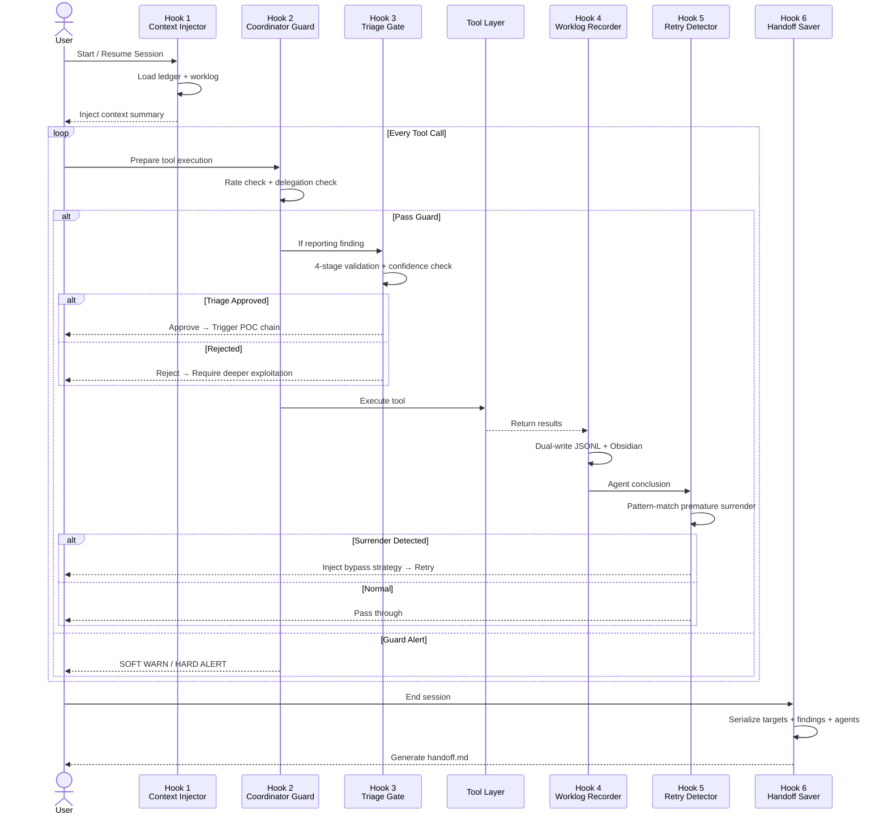
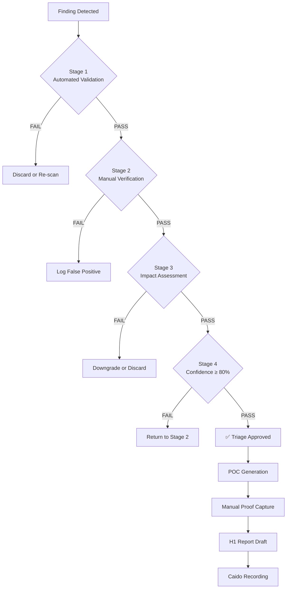

# Mastermind Bug Bounty — Autonomous Offensive Security Orchestration

<p align="center">
  
</p>

<p align="center">
  <a href="#quick-start"></a>
  <a href="#architecture"></a>
  
  
  <a href="LICENSE"></a>
</p>

> A production-grade AI skill system that transforms general-purpose LLM agents into autonomous bug bounty hunters through a **6-Hook lifecycle architecture**. Delivers persistent hunt memory, intelligent triage gates, self-correcting retry logic, and HackerOne-grade output quality — all with zero external dependencies.

---

## Table of Contents

- [Why Mastermind?](#why-mastermind)
- [Core Capabilities](#core-capabilities)
- [Architecture](#architecture)
- [Project Structure](#project-structure)
- [Quick Start](#quick-start)
- [Hook Deep Dives](#hook-deep-dives)
- [References: Knowledge Base](#references-knowledge-base)
- [Real-World Scenarios](#real-world-scenarios)
- [Design Philosophy](#design-philosophy)
- [Roadmap](#roadmap)
- [Contributing](#contributing)
- [License](#license)

---

## Why Mastermind?

Traditional AI-assisted security testing suffers from three critical flaws:

| Problem | Typical AI Tools | Mastermind Solution |
|---------|---------------|---------------------|
| **Goldfish Memory** | Starts from zero every session | **Context Injector** restores full hunt state + 30min worklog |
| **Garbage-Out Reports** | Reports every detection as a "finding" | **Triage Gate** enforces impact proof with 4-stage validation |
| **Premature Surrender** | "WAF blocked me" → gives up in 5 minutes | **Retry Detector** pattern-matches defeatism and injects bypass strategies |
| **No Audit Trail** | Actions are invisible and unrecoverable | **Worklog Recorder** dual-writes JSONL + Obsidian for every action |
| **Lost Progress** | Context windows erase long hunts | **Handoff Saver** serializes full state for infinite session continuity |

This project is built for **security researchers, red teams, and bug bounty hunters** who need an AI teammate that thinks like a senior penetration tester — methodical, persistent, and quality-obsessed.

---

## Core Capabilities

### Session Continuity
Resume any hunt exactly where you left off. The Context Injector loads hunt metadata, recent findings, active agent statuses, and previous session handoffs — eliminating cold-start overhead.

### Intelligent Dual Gating
- **Soft Gate (Coordinator Guard)** — Warns on anti-patterns like enumeration spray or coordinator bypassing specialist delegation. Nudges without blocking.
- **Hard Gate (Triage Gate)** — Blocks any finding that lacks demonstrated impact. Rejects detection-only noise before it pollutes reports.

### Self-Correcting Retries
Detects 6 categories of premature surrender (WAF detected, "appears secure", rate limited, etc.) and injects specific bypass techniques. Max 3 retries prevent infinite loops.

### Forensic Logging
Every tool call, agent spawn, finding, guard trigger, and triage decision is timestamped and written to both machine-readable JSONL and human-readable Obsidian Markdown.

### State Handoff
On session end, the Handoff Saver serializes targets, findings-in-progress, agent statuses, and a prioritized next-steps checklist into an Obsidian document — ready for the next session to consume automatically.

---

## Architecture

The skill implements a **6-hook lifecycle** that gates every phase of a bug bounty session:

<p align="center">
  
</p>

<p align="center">
  
</p>

### Architecture Sequence



### Triage Gate Decision Flow



### The 6 Hooks

| # | Hook | Type | File | Gate | Purpose |
|---|------|------|------|------|---------|
| 1 | **Context Injector** | SESSION | `scripts/session_context.py` | N/A | Inject hunt state + 30min worklog on session start |
| 2 | **Coordinator Guard** | PRE-TOOL | `scripts/coordinator_guard.py` | SOFT WARN | Rate-limit warnings + enforce specialist delegation |
| 3 | **Triage Gate** | PRE-TOOL | `scripts/triage_gate.py` | HARD GATE | Block findings without demonstrated impact |
| 4 | **Worklog Recorder** | POST-TOOL | `scripts/worklog_recorder.py` | WRITE-ONLY | Dual-write JSONL + Obsidian for every action |
| 5 | **Retry Detector** | POST-TOOL | `scripts/retry_detector.py` | WRITE-ONLY | Detect premature surrender, suggest bypasses |
| 6 | **Handoff Saver** | COMPACT | `scripts/handoff_saver.py` | WRITE-ONLY | Serialize full hunt state for next session |

---

## Project Structure

```
mastermind-bug-bounty/
├── SKILL.md                          # Main skill definition (Kimi workflow patterns)
├── README.md                         # This file
├── README_CN.md                      # Chinese documentation
│
├── assets/                           # Visual diagrams
│   ├── architecture.svg              # 6-Hook lifecycle architecture diagram
│   └── coverage-radar.svg            # Vulnerability coverage radar chart
│
├── references/                       # Offensive security knowledge base (~6,200 lines)
│   ├── hunt_methodology.md           # Full recon → discovery → validation → report pipeline
│   ├── bug_classes.md                # 10 modern vulnerability classes with exploitation techniques
│   ├── bypass_techniques.md          # WAF/CDN fingerprinting & bypass encyclopedia
│   └── report_templates.md           # HackerOne / Bugcrowd / CVE submission templates
│
└── scripts/                          # Automation tools (zero external dependencies)
    ├── session_context.py            # Hook 1: Context injection
    ├── coordinator_guard.py          # Hook 2: Soft gatekeeping
    ├── triage_gate.py                # Hook 3: Hard triage validation
    ├── worklog_recorder.py           # Hook 4: Dual-channel logging
    ├── retry_detector.py             # Hook 5: Premature surrender detection
    └── handoff_saver.py              # Hook 6: State serialization
```

---

## Quick Start

### Prerequisites

- Python 3.9+
- No external dependencies (stdlib only)

### Installation

```bash
git clone https://github.com/jinyimeng01/mastermind-bug-bounty.git
cd mastermind-bug-bounty
```

### Setting Up a Hunt Directory

Create a standard hunt workspace:

```bash
mkdir -p my-hunt/vault
python3 -c "
import json
json.dump({
    'hunt_id': 'hunt-001',
    'target': 'example.com',
    'scope': ['*.example.com'],
    'status': 'active',
    'start_date': '2026-05-09T00:00:00Z'
}, open('my-hunt/ledger.json', 'w'), indent=2)
"
touch my-hunt/worklog.jsonl
```

### Running the Scripts

All scripts work standalone or as modules:

```bash
# Hook 1: Inject session context
python3 scripts/session_context.py --hunt-dir ./my-hunt

# Hook 2: Check coordinator guard
python3 scripts/coordinator_guard.py --host example.com --tool ffuf

# Hook 3: Validate a finding through triage gate
python3 scripts/triage_gate.py --finding finding.json

# Hook 4: Record a tool call to worklog
python3 scripts/worklog_recorder.py --type tool_call --tool nmap --hunt-dir ./my-hunt

# Hook 5: Detect premature surrender in agent conclusion
python3 scripts/retry_detector.py --conclusion "WAF blocked my request" --class xss

# Hook 6: Save hunt handoff
python3 scripts/handoff_saver.py --hunt-dir ./my-hunt --instructions "Continue XSS testing on admin panel"
```

### Kimi Integration

Load the skill in Kimi by placing `mastermind-bug-bounty/` in your skills directory:

```
# Kimi will auto-detect and load SKILL.md
# All 6 hooks become enforced workflow patterns
# References are loaded on-demand during hunts
```

### Integration with Other AI Agents

While optimized for Kimi, the 6-Hook architecture is agent-agnostic. The Python scripts accept standard JSON input/output, making them compatible with:
- Custom Claude Code / Cursor workflows
- LangChain/LangGraph agent orchestration
- Standalone CI/CD security pipelines
- Custom red team automation frameworks

---

## Hook Deep Dives

### Hook 1: Context Injector

**Trigger:** Every session start / resume / compaction event

**Inputs:**
- `hunt-dir/ledger.json` — Hunt metadata (target, scope, status, depth)
- `hunt-dir/worklog.jsonl` — Timestamped action log
- `hunt-dir/handoff.md` (optional) — Previous session handoff

**Process:**
1. Reads `ledger.json` for hunt metadata
2. Loads the last 30 minutes of `worklog.jsonl` entries
3. Derives active agent statuses from worklog activity patterns
4. Loads the previous session's `handoff.md` if present
5. Formats everything into an injected context block with session statistics

**Outputs:**
- Injected context block (markdown-formatted for AI consumption)
- `session_start` entry appended to `worklog.jsonl`

This eliminates the "goldfish memory" problem — the AI knows exactly where it left off, what was tested, and what remains open.

---

### Hook 2: Coordinator Guard (Soft Gate)

**Trigger:** Before every tool call during a hunt

**Gate Type:** SOFT — warns and nudges but never blocks execution

**Checks (in order):**

#### Check 1: Host Rate-Limiting (3-Request Rule)
```
COUNT requests to same host in last 5 minutes
    │
    ├─── >= 6 requests ──► HARD WARNING: "Rate limit risk. Rotate agents or pause."
    │
    ├─── 4-5 requests ───► MEDIUM WARNING: "Approaching threshold. Consider rotating."
    │
    ├─── 3 requests ─────► SOFT NUDGE: "3 requests to <host>. Delegate to specialist?"
    │
    └─── < 3 requests ───► PASS
```

#### Check 2: Delegation Enforcement
Warns when the coordinator runs specialist tools directly instead of spawning dedicated specialist agents. Prevents the coordinator from becoming a bottleneck.

#### Check 3: Role Appropriateness
Flags direct exploitation, payload generation without specialist involvement, or report writing without triage approval.

**Warning Levels:**

| Level | Visual Prefix | Action | Override |
|-------|---------------|--------|----------|
| SOFT NUDGE | `[NUDGE]` | Suggest alternative | Log and continue |
| MEDIUM WARNING | `[WARN]` | Strong recommendation | Log and suggest alternative |
| HARD WARNING | `[ALERT]` | Critical alert | Log and require explicit override |

---

### Hook 3: Triage Gate (Hard Gate)

**Trigger:** Before any finding is promoted to reportable status

**Gate Type:** HARD — blocks execution until the finding is approved or rejected

**Validation Pipeline:**

Every finding must pass 5 checks:

1. **Target present** — URL or endpoint is specified
2. **Vulnerability class identified** — Known category (XSS, SQLi, etc.)
3. **Detection evidence exists** — Reproducible proof of vulnerability presence
4. **Impact demonstrated** (HARD GATE) — Proof of exploitable outcome (data exfil, privilege escalation, RCE)
5. **Confidence score >= 0.70** — Quantified certainty threshold

**Approved Finding Chain:**
```
TRIAGE APPROVED
       │
       ├──► 1. POC GENERATION — minimal reproducible exploit
       │
       ├──► 2. MANUAL PROOF CAPTURE — screenshots / terminal recordings
       │
       ├──► 3. HACKERONE REPORT DRAFT — structured markdown report
       │
       └──► 4. CAIDO RECORDING — full request/response chain export
```

**Rejection Reasons Logged:**
- Missing target URL
- Unidentified vulnerability class
- Insufficient detection evidence
- Impact not demonstrated (most common failure)
- Confidence below threshold

---

### Hook 4: Worklog Recorder

**Trigger:** After every tool call, agent action, finding, guard trigger, triage event, or error

**Dual-Channel Output:**

| Channel | Format | File | Purpose |
|---------|--------|------|---------|
| Machine-Readable | JSONL (1 line per event) | `worklog.jsonl` | Parsing, automation, state reconstruction |
| Human-Readable | Markdown with YAML frontmatter | `vault/worklog.md` | Session review, handoff, context injection |

**Mandatory Events (never skip):**
- Tool calls (any tool, any result)
- Agent spawns / delegations / conclusions
- Findings detected
- Triage gate decisions
- Guard triggers
- Session start / end / compaction
- Errors, timeouts, cancellations
- Negative results ("no vulnerability found" is data)

**JSONL Schema:**
```json
{
  "timestamp": "2026-05-09T10:30:00Z",
  "session_id": "sess_abc123",
  "event": "tool_call",
  "hook": "worklog-recorder",
  "agent_id": "coordinator",
  "tool": "nuclei",
  "target": "https://example.com",
  "status": "success",
  "duration_ms": 4500,
  "details": {},
  "metadata": {
    "finding_id": null,
    "severity": null,
    "confidence": null
  }
}
```

---

### Hook 5: Retry Detector

**Trigger:** After every specialist agent response / conclusion

**Pattern Categories:**

| Category | Trigger Phrases | Injection Strategy |
|----------|----------------|-------------------|
| **Defeatist Language** | "WAF detected", "appears secure", "cannot bypass", "gave up" | Encoding bypass, header rotation, parameter pollution |
| **Insufficient Effort** | < 3 tool calls, no findings + no reasoning, skipped methodology steps | Expand scope, require minimum 10 test vectors |
| **Bypassable Obstacles** | "Captcha detected" (no bypass attempt), "Rate limited" (no throttle attempt), "403 Forbidden" (no bypass attempt) | Specific obstacle bypass instructions from references |

**Retry Limits:**
- Max 3 retries per agent to prevent infinite loops
- Retry 1: Full retry with bypass instructions
- Retry 2: Expanded scope with additional techniques
- Retry 3: Final attempt with all remaining techniques
- After 3 retries: Accept conclusion, flag for manual review in handoff

---

### Hook 6: Handoff Saver

**Trigger:** Session end, explicit `/compact` command, or context window exhaustion

**Serialization Checklist:**
1. **Active Targets** — URL, current test phase, last-tested endpoint
2. **Findings In Progress** — ID, type, severity, triage stage, next action
3. **Agent Statuses** — ID, type, current task, last output, retry count
4. **Next Steps** — Priority-ordered list with estimated effort
5. **Custom Instructions** — User-provided context for next session

**Output:** `vault/handoff_TIMESTAMP.md`

```markdown
---
type: hunt-handoff
status: READY
session_id: sess_abc123
hunt_id: hunt_20250509_x
created_at: 2026-05-09T12:00:00Z
previous_session_duration: 3h24m
---

# Hunt Handoff: example.com Bug Bounty

## Active Targets
| Target | Phase | Last Tested | Notes |
|--------|-------|-------------|-------|
| https://example.com/api | Authentication testing | /api/v1/login | OAuth flow in progress |

## Findings In Progress
### find_001 — SQL Injection (HIGH)
- **Status**: Triage approved, PoC generated
- **Next**: Manual proof capture, H1 report draft

## Next Steps (Priority Order)
1. [HIGH] Complete manual proof capture for find_001
2. [MEDIUM] Continue xss-hunter-001 retry (WAF bypass)
```

**Lifecycle:**
```
┌─────────┐     Session loads      ┌──────────┐
│  READY  │ ──────────────────────►│ CONSUMED │
│ (saved) │     Context Injector   │ (loaded) │
└─────────┘                        └──────────┘
                                          │
                                          │ Session ends
                                          ▼
                                    ┌──────────┐
                                    │  READY   │
                                    │ (saved)  │
                                    └──────────┘
```

---

## References: Knowledge Base

The `references/` directory contains a ~6,200-line offensive security knowledge base designed for autonomous consumption by AI agents.

### `references/hunt_methodology.md` (1,493 lines)

Complete autonomous bug bounty methodology covering:
- **Reconnaissance** — subdomain enumeration, tech fingerprinting, JS analysis, API discovery, cloud asset mapping
- **Vulnerability Discovery** — systematic testing by priority, context-aware payloads, vulnerability chaining strategies
- **Impact Validation** — 4-level escalation framework, safe data extraction, account takeover PoC construction
- **Report & Delivery** — HackerOne structure, CVSS 3.1 scoring, responsible disclosure timelines
- **Retry & Bypass** — WAF fingerprinting, encoding tricks, time-based evasion, distributed request patterns

### `references/bug_classes.md` (2,087 lines)

10 modern vulnerability classes with detection + exploitation techniques:
- **XSS** — Reflected/Stored/DOM/Blind, context analysis, DOMPurify bypass, 5-rotor mutation strategies
- **SQL Injection** — Error/Boolean/Time/Union-based, NoSQL injection, ORM patterns, second-order detection
- **SSRF** — Basic/Blind variants, cloud metadata extraction (AWS/GCP/Azure), protocol smuggling, DNS rebinding
- **CORS** — 3-part exploitability test, preflight bypass techniques, null origin exploitation
- **Authentication** — OAuth/OIDC/PKCE chain attacks, JWT attacks (alg:none, KID manipulation), MFA bypass vectors
- **Authorization** — IDOR patterns, path traversal variants, mass assignment exploitation
- **Prototype Pollution** — Detection across JavaScript/Node.js/Python, gadget chain construction, DOMPurify bypass
- **XML & File Parsing** — XXE variants (file-based, error-based, blind), billion laughs attack, zip slip
- **Infrastructure** — Container escape techniques, Kubernetes attack chains, S3 bucket enumeration, serverless injection
- **Business Logic** — Race condition exploitation, price manipulation, workflow bypass patterns

### `references/bypass_techniques.md` (1,443 lines)

Comprehensive WAF/defense bypass encyclopedia:
- 13 WAF fingerprinting signatures (Cloudflare, Akamai, Imperva, AWS WAF, ModSecurity, etc.)
- Encoding & mutation matrix: URL encoding, double-URL, HTML entities, Unicode normalization, case variation, null byte injection
- XSS-specific bypass: 20+ HTML5 tags, 60+ event handlers, protocol bypasses, template injection vectors
- SQLi-specific bypass: comment styles by database engine, string concatenation, whitespace alternatives, CASE injection
- Command injection: metacharacter substitution, encoding tricks, blind command injection timing
- Rate limit evasion: timing jitter algorithms, proxy rotation strategies, session management techniques

### `references/report_templates.md` (1,196 lines)

Professional report templates for multiple platforms:
- **HackerOne** — Title format, CVSS justification, reproduction steps, PoC embedding, impact assessment, fix validation
- **Bugcrowd** — P1-P5 priority calculation, structured template, attachment requirements, bounty justification
- **CVE Request** — CNA coordination process, description standards, reference formatting, timeline documentation
- **Internal Documentation** — Obsidian vault structure, JSONL schema documentation, 45+ category taxonomy

---

## Real-World Scenarios

### Scenario A: Multi-Day Engagement
A red team engagement spans 5 days. Each morning, the Context Injector loads the previous day's handoff, restoring exact test progress. No time is lost re-discovering endpoints or re-testing confirmed-safe routes.

### Scenario B: False Positive Prevention
An automated scanner detects a potential SQLi on a search parameter. The Triage Gate blocks promotion because only an error message was observed — no data extraction or impact demonstration. The finding is returned for deeper exploitation instead of polluting the report pipeline.

### Scenario C: WAF Evasion
A specialist agent concludes "WAF is blocking all XSS payloads" after 2 attempts. The Retry Detector pattern-matches this as defeatist language, injects 8 specific bypass techniques (encoding, header rotation, parameter pollution, protocol switching), and retries. The 3rd attempt successfully demonstrates a bypass.

### Scenario D: Audit Compliance
A client requires full documentation of every action taken during a penetration test. The Worklog Recorder's JSONL output provides machine-parseable evidence of methodology adherence, while the Obsidian Markdown provides human-readable session narratives.

---

## Design Philosophy

This skill follows three core principles proven in high-performance offensive security operations:

**1. Persistence beats intelligence**
A hunter that remembers every target tested, every payload fired, and every conclusion reached will outperform a smarter hunter that starts from zero each session. Memory is the ultimate competitive advantage.

**2. Gating beats filtering**
Blocking a bad finding at the triage gate is 100x cheaper than cleaning up a false-positive report after it reaches the client. Hard gates at confidence/impact thresholds enforce quality by construction, not by cleanup.

**3. Retry beats surrender**
Most "WAF blocked me" conclusions are premature. Pattern-matching defeatist language and injecting bypass strategies turns a 5-minute give-up into a 30-minute successful exploitation. The difference between a $0 bounty and a $5,000 bounty is often persistence.

---

## Roadmap

- [x] 6-Hook core architecture
- [x] Dual-channel logging (JSONL + Obsidian)
- [x] 4-stage triage gate with confidence scoring
- [x] 6-category retry detector with bypass injection
- [x] State serialization and handoff system
- [x] Visual architecture diagrams (SVG)
- [ ] Web dashboard for hunt visualization
- [ ] Integration with Caido HTTP toolkit
- [ ] Automated CVSS 3.1 scoring module
- [ ] Plugin system for custom hooks
- [ ] CI/CD security pipeline templates

---

## Contributing

Contributions are welcome in these areas:

- **New bypass techniques** — add to `references/bypass_techniques.md`
- **Additional bug classes** — extend `references/bug_classes.md`
- **Script improvements** — Python scripts are stdlib-only, keep them dependency-free
- **Report templates** — add templates for other platforms (Intigriti, Synack, YesWeHack, etc.)
- **Translations** — help improve `README_CN.md` or add other language versions

Please open an issue before large changes to discuss alignment with the architecture.

---

## License

MIT License — see [LICENSE](LICENSE) for details.

---

*Built for hunters who don't stop at detection.*
