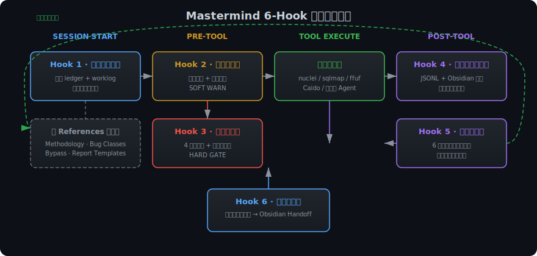
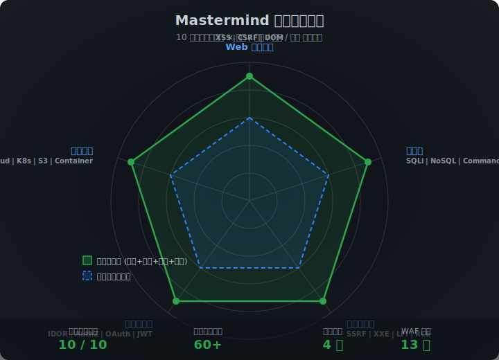
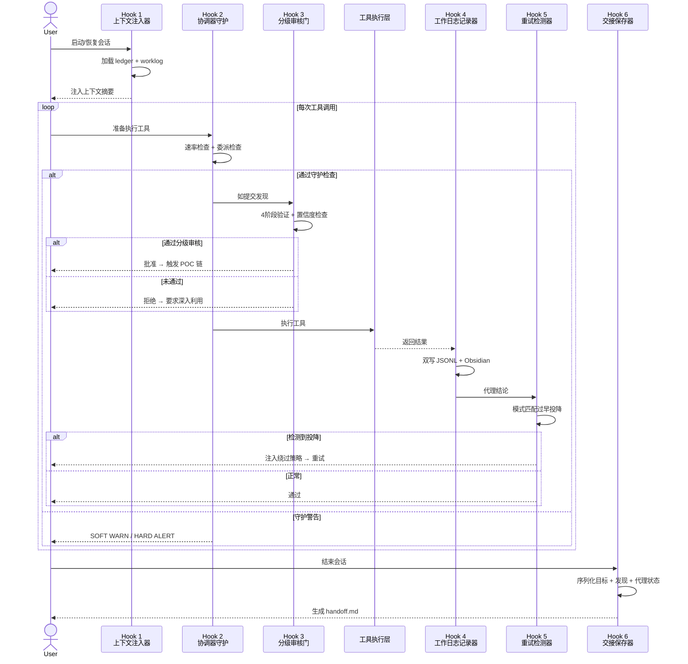
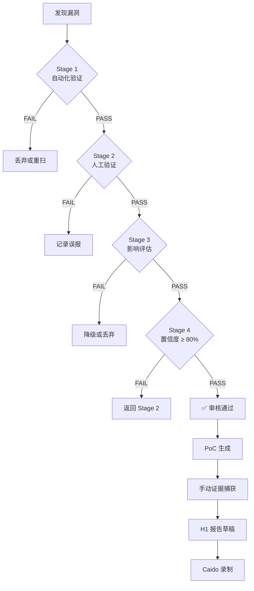

# Mastermind Bug Bounty — 自主化漏洞赏金编排系统

<p align="center">
  
</p>

<p align="center">
  <a href="#快速开始"></a>
  <a href="#架构设计"></a>
  
  
  <a href="LICENSE"></a>
</p>

> 一套生产级 AI 技能系统，通过 **6-Hook 生命周期架构** 将通用大语言模型代理转化为自主漏洞赏金猎人。提供持久狩猎记忆、智能分级审核门、自校正重试逻辑以及 HackerOne 级别的输出质量 —— 全部零外部依赖。

---

## 目录

- [为什么选择 Mastermind？](#为什么选择-mastermind)
- [核心能力](#核心能力)
- [架构设计](#架构设计)
- [项目结构](#项目结构)
- [快速开始](#快速开始)
- [Hook 深度解析](#hook-深度解析)
- [知识库内容](#知识库内容)
- [实战场景](#实战场景)
- [设计哲学](#设计哲学)
- [路线图](#路线图)
- [贡献指南](#贡献指南)
- [许可证](#许可证)

---

## 为什么选择 Mastermind？

传统的 AI 辅助安全测试存在三大致命缺陷：

| 问题 | 普通 AI 工具 | Mastermind 解决方案 |
|---------|---------------|---------------------|
| **金鱼记忆** | 每次会话从零开始 | **上下文注入器** 恢复完整狩猎状态 + 30 分钟工作日志 |
| **垃圾报告** | 将每次检测都当作"发现"上报 | **分级审核门** 强制要求可证明的影响，4 阶段验证 |
| **过早投降** | "WAF 拦住了" → 5 分钟后放弃 | **重试检测器** 模式匹配失败主义语言并注入绕过策略 |
| **无审计追踪** | 操作不可见且无法恢复 | **工作日志记录器** 对每个动作双写 JSONL + Obsidian |
| **进度丢失** | 上下文窗口擦除长期狩猎 | **交接保存器** 序列化完整状态，支持无限会话连续性 |

本项目面向 **安全研究员、红队成员和漏洞赏金猎人**，他们需要一位像资深渗透测试师一样思考的 AI 队友 —— 方法论严谨、坚韧不拔、对质量执着。

---

## 核心能力

### 会话连续性
随时中断、随时恢复，精确回到上次离开的位置。上下文注入器加载狩猎元数据、近期发现、活跃代理状态和上一次会话交接文档 —— 彻底消除冷启动开销。

### 智能双门管控
- **软门（协调器守护）** — 对枚举喷雾或协调器越权执行专家工具等反模式发出警告。引导而不拦截。
- **硬门（分级审核门）** — 拦截任何缺乏可证明影响的发现。在检测噪声污染报告前将其拒之门外。

### 自校正重试
识别 6 类过早投降行为（检测到 WAF、"看起来安全"、速率限制等）并注入特定绕过技术。最多 3 次重试防止无限循环。

### 取证级日志
每一次工具调用、代理生成、发现、守护触发和分级决策都带时间戳，同时写入机器可读的 JSONL 和人类可读的 Obsidian Markdown。

### 状态交接
会话结束时，交接保存器将目标、进行中的发现、代理状态和优先级排序的下一步清单序列化为 Obsidian 文档 —— 下次会话自动加载。

---

## 架构设计

本技能系统实现了覆盖漏洞赏金全生命周期的 **6-Hook 架构**：

<p align="center">
  
</p>

<p align="center">
  
</p>

### 架构时序图



### 分级审核决策树



### 六大 Hook 一览

| # | Hook | 类型 | 文件 | 门控类型 | 职责 |
|---|------|------|------|----------|------|
| 1 | **上下文注入器** | SESSION | `scripts/session_context.py` | N/A | 会话启动时注入狩猎状态 + 近 30 分钟工作日志 |
| 2 | **协调器守护** | PRE-TOOL | `scripts/coordinator_guard.py` | 软警告 | 速率限制警告 + 强制专家代理委派 |
| 3 | **分级审核门** | PRE-TOOL | `scripts/triage_gate.py` | 硬拦截 | 拦截缺乏可证明影响的发现 |
| 4 | **工作日志记录器** | POST-TOOL | `scripts/worklog_recorder.py` | 仅写入 | 每次操作双写 JSONL + Obsidian |
| 5 | **重试检测器** | POST-TOOL | `scripts/retry_detector.py` | 仅写入 | 检测过早投降，建议绕过方案 |
| 6 | **交接保存器** | COMPACT | `scripts/handoff_saver.py` | 仅写入 | 完整狩猎状态序列化，供下次会话加载 |

---

## 项目结构

```
mastermind-bug-bounty/
├── SKILL.md                          # 主技能定义（Kimi 工作流模式）
├── README.md                         # 英文文档
├── README_CN.md                      # 中文文档（本文件）
│
├── assets/                           # 可视化图表
│   ├── architecture.svg              # 6-Hook 生命周期架构图
│   └── coverage-radar.svg            # 漏洞覆盖雷达图
│
├── references/                       # 攻击面安全知识库（~6,200 行）
│   ├── hunt_methodology.md           # 完整方法论：侦察 → 发现 → 验证 → 报告
│   ├── bug_classes.md                # 10 大类现代漏洞及利用技术
│   ├── bypass_techniques.md          # WAF/CDN 指纹与绕过百科全书
│   └── report_templates.md           # HackerOne / Bugcrowd / CVE 提交模板
│
└── scripts/                          # 自动化工具（零外部依赖，纯标准库）
    ├── session_context.py            # Hook 1: 上下文注入
    ├── coordinator_guard.py          # Hook 2: 软管控
    ├── triage_gate.py                # Hook 3: 硬分级验证
    ├── worklog_recorder.py           # Hook 4: 双通道日志
    ├── retry_detector.py             # Hook 5: 过早投降检测
    └── handoff_saver.py              # Hook 6: 状态序列化
```

---

## 快速开始

### 环境要求

- Python 3.9+
- 零外部依赖（仅使用 Python 标准库）

### 安装

```bash
git clone https://github.com/jinyimeng01/mastermind-bug-bounty.git
cd mastermind-bug-bounty
```

### 创建狩猎工作区

```bash
mkdir -p my-hunt/vault
python3 -c "
import json
json.dump({
    'hunt_id': 'hunt-001',
    'target': 'example.com',
    'scope': ['*.example.com'],
    'status': 'active',
    'start_date': '2026-05-09T00:00:00Z'
}, open('my-hunt/ledger.json', 'w'), indent=2)
"
touch my-hunt/worklog.jsonl
```

### 脚本使用

所有脚本均可独立运行或以模块方式调用：

```bash
# Hook 1: 注入会话上下文
python3 scripts/session_context.py --hunt-dir ./my-hunt

# Hook 2: 协调器守护检查
python3 scripts/coordinator_guard.py --host example.com --tool ffuf

# Hook 3: 分级审核验证发现
python3 scripts/triage_gate.py --finding finding.json

# Hook 4: 记录工具调用到工作日志
python3 scripts/worklog_recorder.py --type tool_call --tool nmap --hunt-dir ./my-hunt

# Hook 5: 检测代理结论中的过早投降
python3 scripts/retry_detector.py --conclusion "WAF blocked my request" --class xss

# Hook 6: 保存狩猎交接文档
python3 scripts/handoff_saver.py --hunt-dir ./my-hunt --instructions "Continue XSS testing on admin panel"
```

### Kimi 集成

将 `mastermind-bug-bounty/` 放入 Kimi 的 skills 目录即可自动加载：

```
# Kimi 将自动检测并加载 SKILL.md
# 所有 6 个 Hook 成为强制执行的工作流模式
# 参考资料在狩猎过程中按需加载
```

### 与其他 AI 代理集成

虽然针对 Kimi 优化，但 6-Hook 架构与具体代理无关。Python 脚本接受标准 JSON 输入/输出，兼容：
- 自定义 Claude Code / Cursor 工作流
- LangChain / LangGraph 代理编排
- 独立 CI/CD 安全流水线
- 自定义红队自动化框架

---

## Hook 深度解析

### Hook 1: 上下文注入器

**触发时机：** 每次会话启动 / 恢复 / 压缩事件

**输入：**
- `hunt-dir/ledger.json` — 狩猎元数据（目标、范围、状态、深度）
- `hunt-dir/worklog.jsonl` — 带时间戳的操作日志
- `hunt-dir/handoff.md`（可选）— 上一次会话交接文档

**处理流程：**
1. 读取 `ledger.json` 获取狩猎元数据
2. 加载 `worklog.jsonl` 最近 30 分钟的条目
3. 从工作日志活动模式中推导活跃代理状态
4. 如存在，加载上一次会话的 `handoff.md`
5. 将所有信息格式化为注入上下文块，附带会话统计

**输出：**
- 注入上下文块（Markdown 格式，供 AI 消费）
- `session_start` 条目追加到 `worklog.jsonl`

这彻底解决了 "金鱼记忆" 问题 —— AI 精确知道上次停在哪里、测试过什么、还有什么待办。

---

### Hook 2: 协调器守护（软门）

**触发时机：** 狩猎期间每次工具调用前

**门控类型：** 软门 —— 仅警告和引导，从不拦截执行

**检查项（按顺序）：**

#### 检查 1：主机速率限制（3 请求规则）
```
统计最近 5 分钟内对同一主机的请求次数
    │
    ├─── >= 6 次请求 ──► 严重警告："速率限制风险。轮换代理或暂停。"
    │
    ├─── 4-5 次请求 ───► 中等警告："接近阈值。考虑轮换。"
    │
    ├─── 3 次请求 ─────► 轻推："已对 <host> 请求 3 次。委派给专家代理？"
    │
    └─── < 3 次请求 ───► 通过
```

#### 检查 2：委派执行
协调器直接运行专家工具而非生成专用专家代理时发出警告。防止协调器成为瓶颈。

#### 检查 3：角色适当性
标记直接利用行为、无专家参与生成载荷、或未经分级审核即撰写报告等操作。

**警告级别：**

| 级别 | 视觉前缀 | 动作 | 覆盖方式 |
|------|----------|------|----------|
| 轻推 | `[NUDGE]` | 建议替代方案 | 记录并继续 |
| 中等警告 | `[WARN]` | 强烈建议 | 记录并建议替代方案 |
| 严重警告 | `[ALERT]` | 关键警报 | 记录并要求明确覆盖 |

---

### Hook 3: 分级审核门（硬门）

**触发时机：** 任何发现被提升为可报告状态前

**门控类型：** 硬门 —— 拦截执行，直到发现被批准或拒绝

**验证管线：**

每个发现必须通过 5 项检查：

1. **目标存在** — 指定了 URL 或端点
2. **漏洞类型已识别** — 已知类别（XSS、SQLi 等）
3. **存在检测证据** — 可复现的漏洞存在证明
4. **影响已证明**（硬门）— 可利用结果的证明（数据外泄、权限提升、RCE）
5. **置信度分数 >= 0.70** — 量化确定性阈值

**通过审核后的完整链：**
```
分级审核通过
       │
       ├──► 1. PoC 生成 — 最小可复现利用
       │
       ├──► 2. 手动证据捕获 — 截图 / 终端录像
       │
       ├──► 3. HackerOne 报告草稿 — 结构化 Markdown 报告
       │
       └──► 4. Caido 录制 — 完整请求/响应链导出
```

**拒绝原因记录：**
- 缺少目标 URL
- 未识别的漏洞类型
- 检测证据不足
- 影响未证明（最常见失败原因）
- 置信度低于阈值

---

### Hook 4: 工作日志记录器

**触发时机：** 每次工具调用、代理动作、发现、守护触发、分级事件或错误后

**双通道输出：**

| 通道 | 格式 | 文件 | 用途 |
|---------|--------|------|---------|
| 机器可读 | JSONL（每事件一行） | `worklog.jsonl` | 解析、自动化、状态重建 |
| 人类可读 | YAML 前置元数据的 Markdown | `vault/worklog.md` | 会话回顾、交接、上下文注入 |

**强制记录事件（永不跳过）：**
- 工具调用（任何工具、任何结果）
- 代理生成 / 委派 / 结论
- 检测到的发现
- 分级审核决策
- 守护触发
- 会话启动 / 结束 / 压缩
- 错误、超时、取消
- 负面结果（"未发现漏洞"也是数据）

**JSONL 模式：**
```json
{
  "timestamp": "2026-05-09T10:30:00Z",
  "session_id": "sess_abc123",
  "event": "tool_call",
  "hook": "worklog-recorder",
  "agent_id": "coordinator",
  "tool": "nuclei",
  "target": "https://example.com",
  "status": "success",
  "duration_ms": 4500,
  "details": {},
  "metadata": {
    "finding_id": null,
    "severity": null,
    "confidence": null
  }
}
```

---

### Hook 5: 重试检测器

**触发时机：** 每次专家代理响应 / 结论后

**模式类别：**

| 类别 | 触发短语 | 注入策略 |
|----------|----------------|-------------------|
| **失败主义语言** | "检测到 WAF"、"看起来安全"、"无法绕过"、"放弃了" | 编码绕过、头部轮换、参数污染 |
| **努力不足** | 少于 3 次工具调用、无发现 + 无推理、跳过方法论步骤 | 扩展范围，要求最少 10 个测试向量 |
| **可绕过障碍** | "检测到验证码"（无绕过尝试）、"速率限制"（无节流尝试）、"403 Forbidden"（无绕过尝试） | 从知识库引用特定障碍绕过指令 |

**重试限制：**
- 每个代理最多 3 次重试，防止无限循环
- 第 1 次重试：附带绕过指令的完整重试
- 第 2 次重试：扩展范围，增加额外技术
- 第 3 次重试：使用所有剩余技术的最终尝试
- 3 次重试后：接受结论，在交接中标记为需人工审查

---

### Hook 6: 交接保存器

**触发时机：** 会话结束、显式 `/compact` 命令或上下文窗口耗尽

**序列化清单：**
1. **活跃目标** — URL、当前测试阶段、最后测试端点
2. **进行中的发现** — ID、类型、严重度、分级阶段、下一步动作
3. **代理状态** — ID、类型、当前任务、最后输出、重试次数
4. **下一步** — 带预估工作量的优先级排序清单
5. **自定义指令** — 用户为下次会话提供的上下文

**输出：** `vault/handoff_TIMESTAMP.md`

```markdown
---
type: hunt-handoff
status: READY
session_id: sess_abc123
hunt_id: hunt_20250509_x
created_at: 2026-05-09T12:00:00Z
previous_session_duration: 3h24m
---

# 狩猎交接：example.com 漏洞赏金

## 活跃目标
| 目标 | 阶段 | 最后测试 | 备注 |
|--------|-------|-------------|-------|
| https://example.com/api | 认证测试 | /api/v1/login | OAuth 流程进行中 |

## 进行中的发现
### find_001 — SQL 注入（高危）
- **状态**：分级通过，PoC 已生成
- **下一步**：手动证据捕获，H1 报告草稿

## 下一步（按优先级）
1. [高危] 完成 find_001 手动证据捕获
2. [中危] 继续 xss-hunter-001 重试（WAF 绕过）
```

**生命周期：**
```
┌─────────┐     会话加载       ┌──────────┐
│  就绪   │ ─────────────────►│ 已消费   │
│（保存） │     上下文注入器   │（已加载）│
└─────────┘                    └──────────┘
                                    │
                                    │ 会话结束
                                    ▼
                              ┌──────────┐
                              │  就绪    │
                              │（保存）  │
                              └──────────┘
```

---

## 知识库内容

`references/` 目录包含约 6,200 行的攻击面安全知识库，专为 AI 代理自主消费而设计。

### `references/hunt_methodology.md` (1,493 行)

完整的自主漏洞赏金方法论，涵盖：
- **侦察** — 子域名枚举、技术指纹识别、JS 分析、API 发现、云资产映射
- **漏洞发现** — 按优先级系统化测试、上下文感知载荷、漏洞链策略
- **影响验证** — 4 级升级框架、安全数据提取、账户接管 PoC 构建
- **报告与交付** — HackerOne 结构、CVSS 3.1 评分、负责任的披露时间线
- **重试与绕过** — WAF 指纹识别、编码技巧、基于时间的规避、分布式请求模式

### `references/bug_classes.md` (2,087 行)

10 大类现代漏洞，含检测与利用方法：
- **XSS** — 反射型/存储型/DOM 型/盲打，上下文分析，DOMPurify 绕过，5 轮变异策略
- **SQL 注入** — 报错/布尔/时间/联合，NoSQL 注入，ORM 模式，二阶检测
- **SSRF** — 基础/盲打变体，云元数据提取（AWS/GCP/Azure），协议走私，DNS 重绑定
- **CORS** — 三部分可利用性测试，预检绕过技术，null origin 利用
- **认证** — OAuth/OIDC/PKCE 链路攻击，JWT 攻击（alg:none、KID 操纵），MFA 绕过向量
- **授权** — IDOR 模式，路径遍历变体，批量赋值利用
- **原型污染** — 跨 JavaScript/Node.js/Python 检测，gadget 链构建，DOMPurify 绕过
- **XML 与文件解析** — XXE 变体（基于文件、基于报错、盲打），十亿笑声攻击，zip slip
- **基础设施** — 容器逃逸技术，Kubernetes 攻击链，S3 桶枚举，无服务器注入
- **业务逻辑** — 竞争条件利用，价格操纵，工作流绕过模式

### `references/bypass_techniques.md` (1,443 行)

全面的 WAF/防御绕过百科全书：
- 13 种 WAF 指纹签名（Cloudflare、Akamai、Imperva、AWS WAF、ModSecurity 等）
- 编码与变异矩阵：URL 编码、双重 URL、HTML 实体、Unicode 规范化、大小写变化、空字节注入
- XSS 专项绕过：20+ HTML5 标签，60+ 事件处理器，协议绕过，模板注入向量
- SQLi 专项绕过：按数据库引擎类型的注释风格、字符串拼接、空白替代、CASE 注入
- 命令注入：元字符替换、编码技巧、盲命令注入计时
- 速率限制规避：计时抖动算法、代理轮换策略、会话管理技术

### `references/report_templates.md` (1,196 行)

多平台专业报告模板：
- **HackerOne** — 标题格式、CVSS 论证、复现步骤、PoC 嵌入、影响评估、修复验证
- **Bugcrowd** — P1-P5 优先级计算、结构化模板、附件要求、赏金论证
- **CVE 申请** — CNA 协调流程、描述标准、参考格式、时间线文档
- **内部文档** — Obsidian 知识库结构、JSONL 模式文档、45+ 分类体系

---

## 实战场景

### 场景 A：多日持续性测试
一次红队测试持续 5 天。每天早晨，上下文注入器加载前一天的交接文档，恢复精确的测试进度。无需浪费时间重新发现端点或重新测试已确认安全的路径。

### 场景 B：误报预防
自动化扫描器在搜索参数上检测到潜在 SQLi。分级审核门阻止其升级，因为仅观察到报错信息 —— 没有数据提取或影响证明。该发现被退回要求深入利用，而非污染报告管线。

### 场景 C：WAF 规避
专家代理在 2 次尝试后得出结论："WAF 拦住了所有 XSS 载荷"。重试检测器将其模式匹配为失败主义语言，注入 8 种特定绕过技术（编码、头部轮换、参数污染、协议切换）并重试。第 3 次尝试成功演示了绕过。

### 场景 D：审计合规
客户要求完整记录渗透测试期间采取的每项行动。工作日志记录器的 JSONL 输出提供了方法论遵循的机器可解析证据，而 Obsidian Markdown 提供了人类可读的会话叙事。

---

## 设计哲学

本技能遵循在高性能进攻性安全操作中得到验证的三大核心原则：

**1. 持久性胜于智能**
一个记住每个测试目标、每个发射载荷和每个结论的猎人，每次会话都从零开始的更聪明的猎人表现更优。记忆是终极竞争优势。

**2. 管控胜于过滤**
在分级审核门拦截一个坏发现，比客户收到后清理一份误报报告便宜 100 倍。在置信度/影响阈值处设置硬门，从根本上保证质量，而非事后清理。

**3. 重试胜于投降**
大多数 "WAF 拦截了我" 的结论都为时过早。对失败主义语言进行模式匹配并注入绕过策略，能将 5 分钟的放弃转化为 30 分钟的成功利用。0 美元赏金和 5,000 美元赏金之间的差距往往是坚持。

---

## 路线图

- [x] 6-Hook 核心架构
- [x] 双通道日志（JSONL + Obsidian）
- [x] 带置信度评分的 4 阶段分级审核门
- [x] 带绕过注入的 6 类别重试检测器
- [x] 状态序列化与交接系统
- [x] 可视化架构图（SVG）
- [ ] 狩猎可视化 Web 仪表盘
- [ ] 与 Caido HTTP 工具包集成
- [ ] 自动化 CVSS 3.1 评分模块
- [ ] 自定义 Hook 插件系统
- [ ] CI/CD 安全流水线模板

---

## 贡献指南

欢迎以下方面的贡献：

- **新的绕过技术** —— 添加到 `references/bypass_techniques.md`
- **额外的漏洞类型** —— 扩展 `references/bug_classes.md`
- **脚本改进** —— Python 脚本仅使用标准库，保持零依赖
- **报告模板** —— 添加其他平台的模板（Intigriti、Synack、YesWeHack 等）
- **翻译** —— 帮助改进 `README_CN.md` 或添加其他语言版本

大型改动前请先开 issue 讨论，确保与架构方向一致。

---

## 许可证

MIT 许可证 —— 详见 [LICENSE](LICENSE) 文件。

---

*为那些不满足于仅检测的猎人而构建。*
